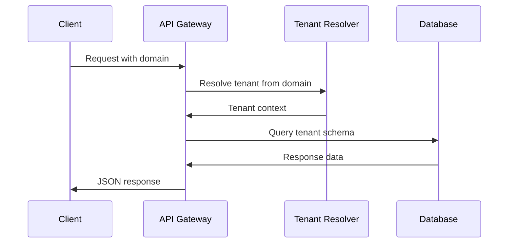

# 🏛️ System Architecture

ClientIQ is built as a modern, scalable multi-tenant SaaS platform using Django and designed with microservice principles in mind.

## 🎯 Architecture Overview

```
┌─────────────────────────────────────────────────────────────┐
│                    Load Balancer                           │
│                   (Nginx/CloudFlare)                       │
└─────────────────────┬───────────────────────────────────────┘
                      │
┌─────────────────────▼───────────────────────────────────────┐
│                Django Application                          │
│  ┌───────────────┐ ┌───────────────┐ ┌───────────────┐    │
│  │   Public      │ │    Tenant     │ │   Management  │    │
│  │   Schema      │ │   Schemas     │ │     APIs      │    │
│  └───────────────┘ └───────────────┘ └───────────────┘    │
└─────────────────────┬───────────────────────────────────────┘
                      │
┌─────────────────────▼───────────────────────────────────────┐
│                Data Layer                                   │
│  ┌───────────────┐ ┌───────────────┐ ┌───────────────┐    │
│  │  PostgreSQL   │ │     Redis     │ │   File Store  │    │
│  │   Database    │ │     Cache     │ │   (S3/Local)  │    │
│  └───────────────┘ └───────────────┘ └───────────────┘    │
└─────────────────────────────────────────────────────────────┘
```

## 🏗️ Core Components

### 1. Multi-Tenant Architecture

ClientIQ uses **schema-based multi-tenancy** powered by `django-tenants`:

- **Public Schema**: Shared data (tenants, users, subscriptions)
- **Tenant Schemas**: Isolated data per tenant
- **Automatic Routing**: Domain-based tenant resolution

```python
# Example: Tenant isolation
# Public schema: clientiq.com/admin
# Tenant schema: acme.clientiq.com/dashboard
```

### 2. Application Structure

```
apps/
├── tenants/          # Multi-tenant management
├── users/            # User authentication & management
├── permissions/      # Role-based access control
├── subscriptions/    # Billing & subscription management
├── payments/         # Payment processing
├── translations/     # Multi-language support
├── demo/             # Demo request handling
├── authentication/   # JWT authentication
└── common/           # Shared utilities
```

### 3. API Architecture

- **RESTful Design**: Consistent REST principles
- **API Versioning**: URL-based versioning (`/api/v1/`)
- **Authentication**: JWT-based authentication
- **Authorization**: Role-based permissions
- **Serialization**: Django REST Framework serializers

## 🔐 Security Architecture

### Authentication Flow



### Security Layers

1. **Transport Security**: HTTPS/TLS encryption
2. **Authentication**: JWT tokens with refresh mechanism
3. **Authorization**: Role-based access control (RBAC)
4. **Tenant Isolation**: Schema-level data separation
5. **Input Validation**: Comprehensive request validation
6. **Rate Limiting**: API throttling and abuse prevention

## 📊 Data Architecture

### Database Design

**Multi-Schema Architecture:**

```sql
-- Public schema (shared)
public.tenants
public.domains  
public.users
public.subscriptions

-- Tenant schemas (isolated)
tenant_acme.users
tenant_acme.projects
tenant_acme.data

tenant_widgets.users
tenant_widgets.projects
tenant_widgets.data
```

### Data Flow

1. **Request arrives** with domain (e.g., `acme.clientiq.com`)
2. **Tenant middleware** resolves tenant from domain
3. **Database queries** use tenant-specific schema
4. **Response** contains only tenant's data

## 🚀 Scalability Design

### Horizontal Scaling

- **Stateless Application**: No server-side sessions
- **Database Connection Pooling**: Efficient connection management
- **Caching Strategy**: Redis for session and query caching
- **CDN Integration**: Static asset delivery optimization

### Performance Optimizations

- **Query Optimization**: Optimized database queries with select_related/prefetch_related
- **Pagination**: Cursor-based pagination for large datasets
- **Background Tasks**: Celery for async processing
- **Caching**: Multi-level caching strategy

## 🔄 API Design Patterns

### RESTful Conventions

```http
GET    /api/v1/tenants/              # List tenants
POST   /api/v1/tenants/              # Create tenant
GET    /api/v1/tenants/{id}/         # Retrieve tenant
PUT    /api/v1/tenants/{id}/         # Update tenant
DELETE /api/v1/tenants/{id}/         # Delete tenant
```

### Response Format

```json
{
  "success": true,
  "data": {
    "id": "uuid",
    "attributes": {},
    "relationships": {}
  },
  "meta": {
    "pagination": {},
    "timestamp": "2025-08-17T10:00:00Z"
  }
}
```

### Error Handling

```json
{
  "success": false,
  "error": {
    "code": "VALIDATION_ERROR",
    "message": "Invalid input provided",
    "details": {
      "field": ["This field is required"]
    }
  },
  "meta": {
    "timestamp": "2025-08-17T10:00:00Z"
  }
}
```

## 🏢 Multi-Tenant Request Flow

### Domain Resolution

```python
# 1. Request arrives: https://acme.clientiq.com/api/v1/users/
# 2. Middleware extracts domain: acme.clientiq.com
# 3. Resolve tenant: Tenant.objects.get(domains__domain='acme.clientiq.com')
# 4. Set schema context: connection.set_schema(tenant.schema_name)
# 5. Execute queries in tenant schema
```

### Tenant Isolation

- **Database Level**: Separate PostgreSQL schemas
- **Application Level**: Tenant context in all queries
- **File Storage**: Tenant-specific directories
- **Caching**: Tenant-prefixed cache keys

## 📱 Frontend Architecture

### API Integration

```typescript
// Base API client configuration
const apiClient = axios.create({
  baseURL: process.env.NEXT_PUBLIC_API_URL,
  headers: {
    'Content-Type': 'application/json',
  },
});

// Automatic tenant resolution
apiClient.interceptors.request.use((config) => {
  const tenant = getTenantFromDomain();
  config.headers['X-Tenant'] = tenant;
  return config;
});
```

### State Management

- **Global State**: Context API for authentication
- **Server State**: TanStack Query for API data
- **Local State**: useState/useReducer for component state
- **Form State**: React Hook Form for form management

## 🔧 Configuration Management

### Environment-Based Configuration

```python
# config/settings/
├── base.py          # Common settings
├── local.py         # Development settings
├── staging.py       # Staging environment
└── production.py    # Production settings
```

### Feature Flags

```python
# Dynamic feature control
FEATURES = {
    'payment_processing': env.bool('ENABLE_PAYMENTS', default=True),
    'advanced_analytics': env.bool('ENABLE_ANALYTICS', default=False),
    'beta_features': env.bool('ENABLE_BETA', default=False),
}
```

## 🔄 Background Processing

### Celery Task Architecture

```python
# Async task processing
@shared_task
def process_payment(payment_id):
    """Process payment asynchronously"""
    payment = Payment.objects.get(id=payment_id)
    # Process payment logic
    return payment.status

# Task scheduling
process_payment.delay(payment.id)
```

### Task Categories

- **User Actions**: Email sending, notifications
- **Data Processing**: Report generation, analytics
- **System Maintenance**: Cleanup tasks, backups
- **External API Calls**: Payment processing, integrations

## 📊 Monitoring & Observability

### Logging Strategy

```python
import structlog

logger = structlog.get_logger(__name__)

logger.info(
    "user_action",
    action="login",
    user_id=user.id,
    tenant=tenant.schema_name,
    ip_address=request.META.get('REMOTE_ADDR')
)
```

### Health Checks

```python
# Health check endpoints
GET /health/                 # Basic health
GET /health/db/             # Database connectivity  
GET /health/cache/          # Redis connectivity
GET /health/detailed/       # Comprehensive status
```

## 🔮 Future Architecture Considerations

### Microservices Migration Path

1. **Phase 1**: Modular monolith (current)
2. **Phase 2**: Extract payment service
3. **Phase 3**: Extract notification service
4. **Phase 4**: Full microservices architecture

### Technology Evolution

- **Database**: Consider read replicas for scaling
- **Caching**: Implement distributed caching
- **Message Queue**: Add event-driven architecture
- **Observability**: Implement distributed tracing

## 📚 Architecture Decision Records (ADRs)

### Key Decisions

1. **Multi-Tenancy**: Schema-based over row-based for better isolation
2. **Authentication**: JWT over sessions for statelessness
3. **Database**: PostgreSQL over NoSQL for ACID compliance
4. **API Design**: REST over GraphQL for simplicity
5. **Frontend**: React TypeScript over Vue for ecosystem

### Trade-offs

| Decision | Pros | Cons |
|----------|------|------|
| Schema-based tenancy | Strong isolation, easier scaling | Complex migrations |
| JWT Authentication | Stateless, scalable | Token management complexity |
| Monolithic structure | Simple deployment, consistency | Potential scaling bottlenecks |

---

**Next Steps:**
- [🏢 Multi-Tenant Deep Dive](./multi-tenant.md)
- [🔐 Authentication Architecture](./auth-system.md)
- [📱 API Design Principles](./api-design.md)
