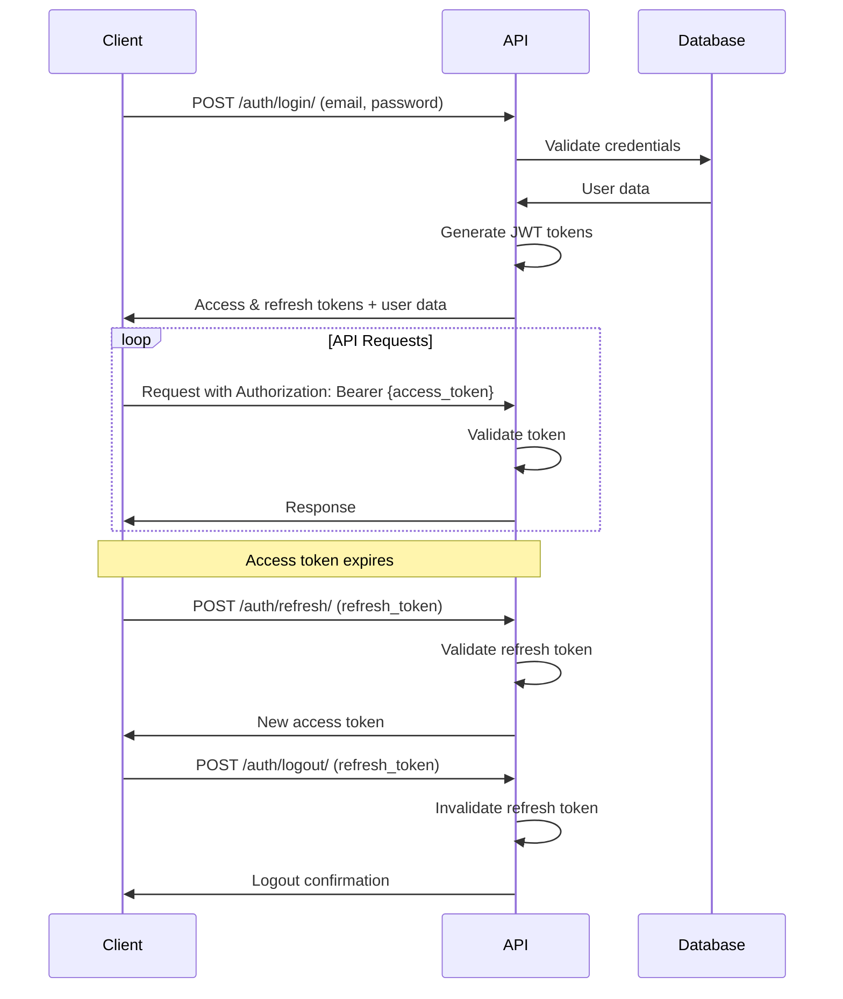

# 🔐 Authentication API

Complete guide to authentication and authorization in ClientIQ, including JWT token management, user registration, and session handling.

## 🌐 Base Endpoints

All authentication endpoints are under `/api/v1/auth/`:

```
POST   /api/v1/auth/login/          # User login
POST   /api/v1/auth/logout/         # User logout  
POST   /api/v1/auth/refresh/        # Refresh access token
GET    /api/v1/auth/me/             # Get current user
POST   /api/v1/auth/register/       # User registration (if enabled)
POST   /api/v1/auth/forgot-password/ # Password reset request
POST   /api/v1/auth/reset-password/ # Password reset confirmation
```

## 🔑 JWT Token Authentication

ClientIQ uses JSON Web Tokens (JWT) for stateless authentication with a dual-token approach:

- **Access Token**: Short-lived (15 minutes), used for API requests
- **Refresh Token**: Long-lived (7 days), used to obtain new access tokens

### Token Structure

```json
{
  "access_token": "eyJ0eXAiOiJKV1QiLCJhbGciOiJIUzI1NiJ9...",
  "refresh_token": "eyJ0eXAiOiJKV1QiLCJhbGciOiJIUzI1NiJ9...",
  "token_type": "Bearer",
  "expires_in": 900
}
```

## 📋 Authentication Endpoints

### 1. User Login

Authenticate user and receive JWT tokens.

**Endpoint:** `POST /api/v1/auth/login/`

**Request:**
```json
{
  "email": "user@example.com",
  "password": "your-password"
}
```

**Response (200 OK):**
```json
{
  "success": true,
  "data": {
    "access_token": "eyJ0eXAiOiJKV1QiLCJhbGciOiJIUzI1NiJ9...",
    "refresh_token": "eyJ0eXAiOiJKV1QiLCJhbGciOiJIUzI1NiJ9...",
    "token_type": "Bearer",
    "expires_in": 900,
    "user": {
      "id": "123",
      "email": "user@example.com",
      "first_name": "John",
      "last_name": "Doe",
      "is_active": true,
      "is_tenant_admin": false,
      "user_type": "user",
      "tenant": {
        "id": "456",
        "name": "Acme Corp",
        "schema_name": "acme_corp"
      }
    }
  },
  "meta": {
    "timestamp": "2025-08-17T10:00:00Z"
  }
}
```

**Errors:**
- `400 Bad Request`: Invalid request format
- `401 Unauthorized`: Invalid credentials
- `403 Forbidden`: Account disabled or tenant inactive

**Example:**
```bash
curl -X POST https://your-domain.com/api/v1/auth/login/ \
  -H "Content-Type: application/json" \
  -d '{
    "email": "admin@example.com",
    "password": "admin123"
  }'
```

### 2. Token Refresh

Obtain a new access token using a refresh token.

**Endpoint:** `POST /api/v1/auth/refresh/`

**Request:**
```json
{
  "refresh_token": "eyJ0eXAiOiJKV1QiLCJhbGciOiJIUzI1NiJ9..."
}
```

**Response (200 OK):**
```json
{
  "success": true,
  "data": {
    "access_token": "eyJ0eXAiOiJKV1QiLCJhbGciOiJIUzI1NiJ9...",
    "token_type": "Bearer",
    "expires_in": 900
  },
  "meta": {
    "timestamp": "2025-08-17T10:00:00Z"
  }
}
```

**Errors:**
- `401 Unauthorized`: Invalid or expired refresh token

**Example:**
```bash
curl -X POST https://your-domain.com/api/v1/auth/refresh/ \
  -H "Content-Type: application/json" \
  -d '{
    "refresh_token": "your-refresh-token"
  }'
```

### 3. Get Current User

Retrieve information about the authenticated user.

**Endpoint:** `GET /api/v1/auth/me/`

**Headers:**
```
Authorization: Bearer {access_token}
```

**Response (200 OK):**
```json
{
  "success": true,
  "data": {
    "id": "123",
    "email": "user@example.com",
    "first_name": "John",
    "last_name": "Doe",
    "is_active": true,
    "is_tenant_admin": false,
    "user_type": "user",
    "created_at": "2025-01-15T10:30:00Z",
    "updated_at": "2025-08-17T09:15:00Z",
    "tenant": {
      "id": "456",
      "name": "Acme Corp",
      "schema_name": "acme_corp"
    },
    "role": {
      "id": "789",
      "name": "user",
      "display_name": "Regular User",
      "permissions": [
        {
          "id": "101",
          "name": "Can view dashboard",
          "codename": "view_dashboard"
        }
      ]
    }
  },
  "meta": {
    "timestamp": "2025-08-17T10:00:00Z"
  }
}
```

**Example:**
```bash
curl -X GET https://your-domain.com/api/v1/auth/me/ \
  -H "Authorization: Bearer your-access-token"
```

### 4. User Logout

Invalidate refresh token and logout user.

**Endpoint:** `POST /api/v1/auth/logout/`

**Headers:**
```
Authorization: Bearer {access_token}
```

**Request:**
```json
{
  "refresh_token": "eyJ0eXAiOiJKV1QiLCJhbGciOiJIUzI1NiJ9..."
}
```

**Response (200 OK):**
```json
{
  "success": true,
  "data": {
    "message": "Successfully logged out"
  },
  "meta": {
    "timestamp": "2025-08-17T10:00:00Z"
  }
}
```

**Example:**
```bash
curl -X POST https://your-domain.com/api/v1/auth/logout/ \
  -H "Authorization: Bearer your-access-token" \
  -H "Content-Type: application/json" \
  -d '{
    "refresh_token": "your-refresh-token"
  }'
```

## 👤 User Registration

### User Registration (Tenant Users)

Register a new user within an existing tenant.

**Endpoint:** `POST /api/v1/auth/register/`

**Request:**
```json
{
  "email": "newuser@example.com",
  "password": "secure-password",
  "password_confirm": "secure-password",
  "first_name": "Jane",
  "last_name": "Smith",
  "invitation_token": "optional-invitation-token"
}
```

**Response (201 Created):**
```json
{
  "success": true,
  "data": {
    "user": {
      "id": "124",
      "email": "newuser@example.com",
      "first_name": "Jane",
      "last_name": "Smith",
      "is_active": true,
      "user_type": "user"
    },
    "message": "User registered successfully. Please check your email for verification."
  },
  "meta": {
    "timestamp": "2025-08-17T10:00:00Z"
  }
}
```

**Validation Rules:**
- Email must be unique within the tenant
- Password minimum 8 characters
- Password must contain at least one uppercase, lowercase, and number
- First name and last name are required

## 🔐 Password Reset

### Request Password Reset

Initiate password reset process.

**Endpoint:** `POST /api/v1/auth/forgot-password/`

**Request:**
```json
{
  "email": "user@example.com"
}
```

**Response (200 OK):**
```json
{
  "success": true,
  "data": {
    "message": "If an account with this email exists, you will receive a password reset link."
  },
  "meta": {
    "timestamp": "2025-08-17T10:00:00Z"
  }
}
```

### Confirm Password Reset

Complete password reset with token.

**Endpoint:** `POST /api/v1/auth/reset-password/`

**Request:**
```json
{
  "token": "password-reset-token",
  "password": "new-secure-password",
  "password_confirm": "new-secure-password"
}
```

**Response (200 OK):**
```json
{
  "success": true,
  "data": {
    "message": "Password reset successfully"
  },
  "meta": {
    "timestamp": "2025-08-17T10:00:00Z"
  }
}
```

## 🔒 Authorization

### Permission System

ClientIQ uses role-based access control (RBAC) with hierarchical permissions:

```json
{
  "role": {
    "name": "manager",
    "display_name": "Manager",
    "permissions": [
      {
        "codename": "view_dashboard",
        "name": "Can view dashboard"
      },
      {
        "codename": "manage_users",
        "name": "Can manage users"
      },
      {
        "codename": "view_analytics",
        "name": "Can view analytics"
      }
    ]
  }
}
```

### Common Permissions

| Permission | Description | Roles |
|------------|-------------|-------|
| `view_dashboard` | Access main dashboard | All users |
| `manage_users` | Create, edit, delete users | Admin, Manager |
| `manage_tenants` | Manage tenant settings | Admin only |
| `view_analytics` | Access analytics and reports | Admin, Manager |
| `manage_subscriptions` | Handle billing and subscriptions | Admin only |
| `manage_settings` | Modify system settings | Admin only |

### Checking Permissions

Use the `/auth/me/` endpoint to get current user permissions, or check specific permissions:

**Endpoint:** `GET /api/v1/auth/permissions/`

**Response:**
```json
{
  "success": true,
  "data": {
    "permissions": [
      "view_dashboard",
      "manage_users",
      "view_analytics"
    ]
  }
}
```

## 🔄 Authentication Flow

### Standard Login Flow



### Frontend Implementation

```typescript
class AuthService {
  private accessToken: string | null = null;
  private refreshToken: string | null = null;

  async login(email: string, password: string) {
    const response = await fetch('/api/v1/auth/login/', {
      method: 'POST',
      headers: { 'Content-Type': 'application/json' },
      body: JSON.stringify({ email, password }),
    });

    const data = await response.json();
    
    if (data.success) {
      this.accessToken = data.data.access_token;
      this.refreshToken = data.data.refresh_token;
      
      // Store in localStorage/secure storage
      localStorage.setItem('access_token', this.accessToken);
      localStorage.setItem('refresh_token', this.refreshToken);
      
      return data.data.user;
    }
    
    throw new Error(data.error.message);
  }

  async refreshAccessToken() {
    if (!this.refreshToken) {
      throw new Error('No refresh token available');
    }

    const response = await fetch('/api/v1/auth/refresh/', {
      method: 'POST',
      headers: { 'Content-Type': 'application/json' },
      body: JSON.stringify({ refresh_token: this.refreshToken }),
    });

    const data = await response.json();
    
    if (data.success) {
      this.accessToken = data.data.access_token;
      localStorage.setItem('access_token', this.accessToken);
    } else {
      this.logout();
      throw new Error('Token refresh failed');
    }
  }

  async logout() {
    if (this.refreshToken) {
      await fetch('/api/v1/auth/logout/', {
        method: 'POST',
        headers: {
          'Content-Type': 'application/json',
          'Authorization': `Bearer ${this.accessToken}`,
        },
        body: JSON.stringify({ refresh_token: this.refreshToken }),
      });
    }

    this.accessToken = null;
    this.refreshToken = null;
    localStorage.removeItem('access_token');
    localStorage.removeItem('refresh_token');
  }

  getAccessToken() {
    return this.accessToken || localStorage.getItem('access_token');
  }

  async makeAuthenticatedRequest(url: string, options: RequestInit = {}) {
    const token = this.getAccessToken();
    
    const response = await fetch(url, {
      ...options,
      headers: {
        ...options.headers,
        'Authorization': `Bearer ${token}`,
      },
    });

    if (response.status === 401) {
      await this.refreshAccessToken();
      // Retry with new token
      return this.makeAuthenticatedRequest(url, options);
    }

    return response;
  }
}
```

## 🛡️ Security Best Practices

### Token Storage

**Recommended Storage:**
```typescript
// For web applications
const secureStorage = {
  setItem(key: string, value: string) {
    // Use httpOnly cookies for refresh tokens
    document.cookie = `${key}=${value}; HttpOnly; Secure; SameSite=Strict`;
  },
  
  getItem(key: string) {
    // Parse from cookies
    return document.cookie
      .split('; ')
      .find(row => row.startsWith(`${key}=`))
      ?.split('=')[1];
  }
};

// Store access token in memory/sessionStorage
// Store refresh token in httpOnly cookie
```

### CSRF Protection

Include CSRF tokens for sensitive operations:

```typescript
// Get CSRF token from meta tag or API
const csrfToken = document.querySelector('meta[name="csrf-token"]').content;

fetch('/api/v1/auth/sensitive-action/', {
  method: 'POST',
  headers: {
    'X-CSRFToken': csrfToken,
    'Authorization': `Bearer ${accessToken}`,
  },
});
```

### Rate Limiting

Authentication endpoints have specific rate limits:

| Endpoint | Limit | Window |
|----------|-------|--------|
| `/auth/login/` | 5 attempts | 15 minutes |
| `/auth/refresh/` | 10 requests | 1 minute |
| `/auth/forgot-password/` | 3 requests | 1 hour |

## 🧪 Testing Authentication

### Test Login

```bash
# Test successful login
curl -X POST https://your-domain.com/api/v1/auth/login/ \
  -H "Content-Type: application/json" \
  -d '{
    "email": "admin@clientiq.com",
    "password": "admin123"
  }'

# Test invalid credentials
curl -X POST https://your-domain.com/api/v1/auth/login/ \
  -H "Content-Type: application/json" \
  -d '{
    "email": "wrong@email.com",
    "password": "wrongpassword"
  }'
```

### Test Protected Endpoint

```bash
# Get access token from login response
ACCESS_TOKEN="your-access-token"

# Test authenticated request
curl -X GET https://your-domain.com/api/v1/auth/me/ \
  -H "Authorization: Bearer $ACCESS_TOKEN"

# Test without token (should return 401)
curl -X GET https://your-domain.com/api/v1/auth/me/
```

## 🚨 Error Handling

### Common Error Responses

**Invalid Credentials (401):**
```json
{
  "success": false,
  "error": {
    "code": "INVALID_CREDENTIALS",
    "message": "Invalid email or password",
    "details": {}
  },
  "meta": {
    "timestamp": "2025-08-17T10:00:00Z"
  }
}
```

**Token Expired (401):**
```json
{
  "success": false,
  "error": {
    "code": "TOKEN_EXPIRED",
    "message": "Access token has expired",
    "details": {
      "expired_at": "2025-08-17T09:45:00Z"
    }
  },
  "meta": {
    "timestamp": "2025-08-17T10:00:00Z"
  }
}
```

**Account Disabled (403):**
```json
{
  "success": false,
  "error": {
    "code": "ACCOUNT_DISABLED",
    "message": "Your account has been disabled",
    "details": {}
  },
  "meta": {
    "timestamp": "2025-08-17T10:00:00Z"
  }
}
```

## 📚 Related Documentation

- [👥 Users API](./users.md) - User management endpoints
- [🏢 Tenants API](./tenants.md) - Tenant-specific operations
- [🛡️ Permissions API](./permissions.md) - Role and permission management
- [⚛️ Frontend Auth Integration](../04-frontend/auth-flow.md) - Frontend implementation

---

**Next Steps:**
- [🏢 Multi-Tenant Authentication](../02-architecture/multi-tenant.md)
- [🔒 Security Best Practices](../06-deployment/security.md)
- [🧪 Testing Authentication](../05-development/testing.md)
