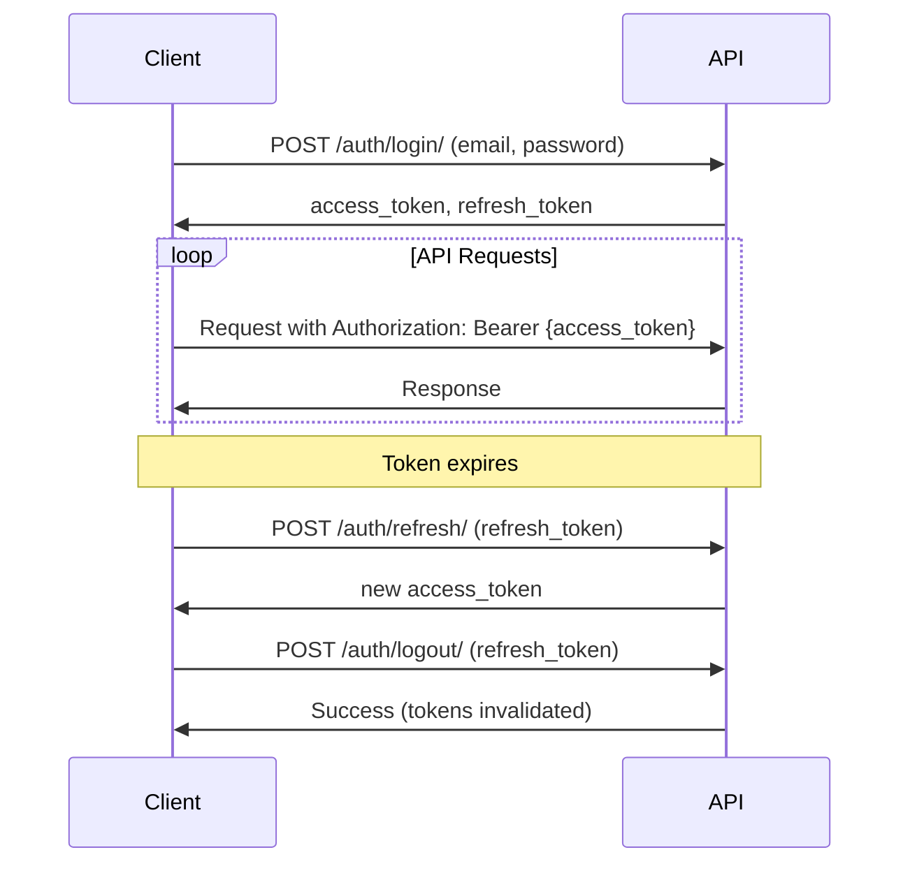

# 📋 API Overview

Welcome to the ClientIQ API documentation! This comprehensive guide covers all endpoints, authentication methods, and integration patterns for building applications on top of ClientIQ.

## 🌐 Base Information

**Base URL:** `https://your-domain.com/api/v1/`  
**Authentication:** JWT Bearer Token  
**Content Type:** `application/json`  
**Rate Limiting:** 1000 requests/hour per user

## 🚀 Quick Start

### 1. Authentication

```bash
# Login to get access token
curl -X POST https://your-domain.com/api/v1/auth/login/ \
  -H "Content-Type: application/json" \
  -d '{
    "email": "user@example.com",
    "password": "your-password"
  }'
```

**Response:**
```json
{
  "success": true,
  "data": {
    "access_token": "eyJ0eXAiOiJKV1QiLCJhbGciOiJIUzI1NiJ9...",
    "refresh_token": "eyJ0eXAiOiJKV1QiLCJhbGciOiJIUzI1NiJ9...",
    "user": {
      "id": "123",
      "email": "user@example.com",
      "first_name": "John",
      "last_name": "Doe"
    }
  }
}
```

### 2. Making Authenticated Requests

```bash
curl -X GET https://your-domain.com/api/v1/users/me/ \
  -H "Authorization: Bearer YOUR_ACCESS_TOKEN"
```

## 🏗️ API Structure

### Endpoint Categories

| Category | Base Path | Description |
|----------|-----------|-------------|
| **Authentication** | `/api/v1/auth/` | Login, logout, token management |
| **Users** | `/api/v1/users/` | User management and profiles |
| **Tenants** | `/api/v1/tenants/` | Tenant administration |
| **Permissions** | `/api/v1/permissions/` | Role-based access control |
| **Subscriptions** | `/api/v1/subscriptions/` | Billing and subscription management |
| **Payments** | `/api/v1/payments/` | Payment processing |
| **Translations** | `/api/v1/translations/` | Multi-language support |
| **Demo** | `/api/v1/demo/` | Demo request management |

## 📊 Standard Response Format

All API responses follow a consistent structure:

### Success Response

```json
{
  "success": true,
  "data": {
    // Response data here
  },
  "meta": {
    "timestamp": "2025-08-17T10:00:00Z",
    "pagination": {
      "page": 1,
      "per_page": 20,
      "total": 100,
      "total_pages": 5
    }
  }
}
```

### Error Response

```json
{
  "success": false,
  "error": {
    "code": "ERROR_CODE",
    "message": "Human-readable error message",
    "details": {
      "field_name": ["Specific validation error"]
    }
  },
  "meta": {
    "timestamp": "2025-08-17T10:00:00Z"
  }
}
```

## 🔐 Authentication & Authorization

### JWT Token Authentication

ClientIQ uses JWT (JSON Web Tokens) for authentication:

1. **Login** with email/password to receive tokens
2. **Include** access token in `Authorization: Bearer {token}` header
3. **Refresh** tokens when they expire
4. **Logout** to invalidate tokens

### Token Lifecycle



### Permission Levels

| Role | Description | Permissions |
|------|-------------|-------------|
| **Super Admin** | Platform administrator | All permissions across all tenants |
| **Tenant Admin** | Tenant administrator | Full access within tenant |
| **Manager** | Department manager | Limited admin access |
| **User** | Regular user | Basic access to assigned resources |
| **Viewer** | Read-only access | View-only permissions |

## 🏢 Multi-Tenant API Access

### Domain-Based Routing

Each tenant has its own subdomain:

```bash
# Tenant-specific API access
https://acme.clientiq.com/api/v1/users/
https://widgets.clientiq.com/api/v1/users/
```

### Tenant Context

The API automatically resolves tenant context from the domain. All data returned is scoped to the requesting tenant.

```python
# Example: Users endpoint
GET /api/v1/users/  # Returns only users for current tenant
```

## 📄 Pagination

### Cursor-Based Pagination

For better performance with large datasets:

```bash
GET /api/v1/users/?cursor=eyJpZCI6MTAwfQ==&limit=20
```

**Response:**
```json
{
  "success": true,
  "data": {
    "results": [...],
    "next": "eyJpZCI6MTIwfQ==",
    "previous": "eyJpZCI6ODByQ==",
    "has_next": true,
    "has_previous": true
  },
  "meta": {
    "pagination": {
      "limit": 20,
      "total_count": 1500
    }
  }
}
```

### Page-Based Pagination

For simple use cases:

```bash
GET /api/v1/users/?page=2&limit=20
```

## 🔍 Filtering & Searching

### Query Parameters

```bash
# Filter by field
GET /api/v1/users/?is_active=true

# Search across fields
GET /api/v1/users/?search=john

# Multiple filters
GET /api/v1/users/?is_active=true&role=admin&search=john

# Date range filtering
GET /api/v1/users/?created_at__gte=2025-01-01&created_at__lt=2025-12-31

# Ordering
GET /api/v1/users/?ordering=-created_at,first_name
```

### Advanced Filtering

```bash
# Field lookups
GET /api/v1/users/?email__contains=@company.com
GET /api/v1/users/?created_at__year=2025
GET /api/v1/users/?role__in=admin,manager

# Exclude filters
GET /api/v1/users/?role__ne=admin
```

## 📝 Field Selection

### Sparse Fieldsets

Request only the fields you need:

```bash
GET /api/v1/users/?fields=id,email,first_name,last_name
```

**Response:**
```json
{
  "success": true,
  "data": {
    "results": [
      {
        "id": "123",
        "email": "john@example.com",
        "first_name": "John",
        "last_name": "Doe"
      }
    ]
  }
}
```

### Including Related Data

```bash
# Include user's role information
GET /api/v1/users/?include=role,tenant

# Multiple levels
GET /api/v1/users/?include=role.permissions,tenant.subscription
```

## 🔄 Bulk Operations

### Bulk Create

```bash
POST /api/v1/users/bulk/
```

**Request:**
```json
{
  "users": [
    {
      "email": "user1@example.com",
      "first_name": "User",
      "last_name": "One"
    },
    {
      "email": "user2@example.com", 
      "first_name": "User",
      "last_name": "Two"
    }
  ]
}
```

### Bulk Update

```bash
PATCH /api/v1/users/bulk/
```

**Request:**
```json
{
  "updates": [
    {
      "id": "123",
      "is_active": false
    },
    {
      "id": "124", 
      "role": "manager"
    }
  ]
}
```

## 📊 API Versioning

### URL Versioning

Current version: `v1`

```bash
# Current API
GET /api/v1/users/

# Future API (when available)
GET /api/v2/users/
```

### Version Lifecycle

- **v1**: Current stable version
- **v2**: Future version (not yet available)

### Breaking Changes

Major version changes include:
- Removed fields or endpoints
- Changed response structure
- Modified authentication methods
- Altered behavior of existing endpoints

## 🚨 Error Handling

### HTTP Status Codes

| Code | Description | When Used |
|------|-------------|-----------|
| **200** | OK | Successful GET, PUT, PATCH |
| **201** | Created | Successful POST |
| **204** | No Content | Successful DELETE |
| **400** | Bad Request | Invalid request data |
| **401** | Unauthorized | Missing or invalid authentication |
| **403** | Forbidden | Insufficient permissions |
| **404** | Not Found | Resource doesn't exist |
| **422** | Unprocessable Entity | Validation errors |
| **429** | Too Many Requests | Rate limit exceeded |
| **500** | Internal Server Error | Server error |

### Error Code Reference

| Error Code | Description | Solution |
|------------|-------------|----------|
| `VALIDATION_ERROR` | Request validation failed | Check request data format |
| `AUTHENTICATION_REQUIRED` | No authentication provided | Include Authorization header |
| `PERMISSION_DENIED` | Insufficient permissions | Contact admin for access |
| `RESOURCE_NOT_FOUND` | Resource doesn't exist | Verify resource ID |
| `RATE_LIMIT_EXCEEDED` | Too many requests | Wait before retrying |
| `TENANT_NOT_FOUND` | Invalid tenant domain | Check domain configuration |

## 🔧 Rate Limiting

### Default Limits

| User Type | Requests/Hour | Burst Limit |
|-----------|---------------|-------------|
| **Anonymous** | 100 | 20 |
| **Authenticated** | 1000 | 100 |
| **Premium** | 5000 | 500 |

### Rate Limit Headers

```http
X-RateLimit-Limit: 1000
X-RateLimit-Remaining: 950
X-RateLimit-Reset: 1629776400
```

### Handling Rate Limits

```python
import time
import requests

def api_request_with_retry(url, headers, max_retries=3):
    for attempt in range(max_retries):
        response = requests.get(url, headers=headers)
        
        if response.status_code == 429:
            # Rate limited, wait and retry
            retry_after = int(response.headers.get('Retry-After', 60))
            time.sleep(retry_after)
            continue
            
        return response
    
    raise Exception("Max retries exceeded")
```

## 🧪 Testing Your Integration

### Using curl

```bash
# Set base URL and token
BASE_URL="https://your-domain.com/api/v1"
TOKEN="your-access-token"

# Test authentication
curl -X GET "$BASE_URL/users/me/" \
  -H "Authorization: Bearer $TOKEN"

# Test creating a resource
curl -X POST "$BASE_URL/users/" \
  -H "Authorization: Bearer $TOKEN" \
  -H "Content-Type: application/json" \
  -d '{
    "email": "test@example.com",
    "first_name": "Test",
    "last_name": "User"
  }'
```

### Using Postman

1. **Import** our Postman collection: [Download Collection](../assets/clientiq-postman.json)
2. **Set environment** variables:
   - `base_url`: Your API base URL
   - `access_token`: Your authentication token
3. **Run tests** using the pre-configured requests

### Using Python

```python
import requests

class ClientIQAPI:
    def __init__(self, base_url, access_token):
        self.base_url = base_url
        self.session = requests.Session()
        self.session.headers.update({
            'Authorization': f'Bearer {access_token}',
            'Content-Type': 'application/json'
        })
    
    def get_users(self, **params):
        response = self.session.get(f'{self.base_url}/users/', params=params)
        return response.json()
    
    def create_user(self, user_data):
        response = self.session.post(f'{self.base_url}/users/', json=user_data)
        return response.json()

# Usage
api = ClientIQAPI('https://your-domain.com/api/v1', 'your-token')
users = api.get_users(is_active=True)
```

## 📚 API Reference

Explore detailed documentation for each endpoint:

### Core APIs
- [🔐 Authentication API](./authentication.md) - Login, logout, token management
- [👥 Users API](./users.md) - User management and profiles
- [🏢 Tenants API](./tenants.md) - Tenant administration

### Feature APIs  
- [🛡️ Permissions API](./permissions.md) - Role-based access control
- [💳 Subscriptions API](./subscriptions.md) - Billing and subscriptions
- [💰 Payments API](./payments.md) - Payment processing
- [🌍 Translations API](./translations.md) - Multi-language support
- [🎯 Demo API](./demo.md) - Demo request management

## 🔮 Coming Soon

### Planned Features

- **GraphQL API**: Alternative to REST for flexible queries
- **Webhooks**: Real-time event notifications
- **API Analytics**: Usage metrics and insights
- **SDK Libraries**: Official SDKs for popular languages

### API Roadmap

| Feature | Version | Timeline |
|---------|---------|----------|
| Enhanced filtering | v1.1 | Q4 2025 |
| GraphQL support | v1.2 | Q1 2026 |
| Webhook system | v1.3 | Q2 2026 |
| API v2 | v2.0 | Q3 2026 |

---

**Next Steps:**
- [🔐 Authentication Guide](./authentication.md)
- [⚛️ Frontend Integration](../04-frontend/react-typescript.md)
- [🧪 Testing Your API](../05-development/testing.md)
