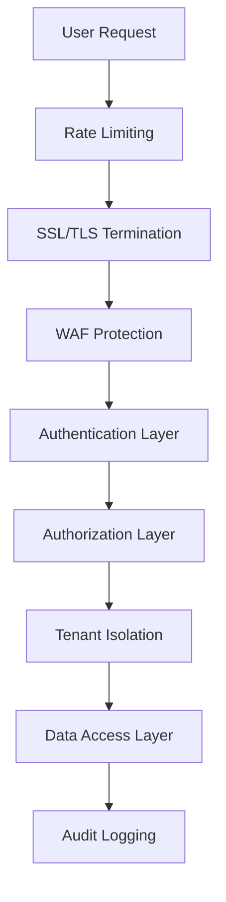

# 🔒 Security Best Practices

Comprehensive security guide for ClientIQ, covering authentication, authorization, data protection, and security monitoring.

## 🛡️ Security Overview

ClientIQ implements multiple layers of security:

- **🔐 Multi-Tenant Isolation** - Schema-based tenant separation
- **🎯 JWT Authentication** - Secure token-based authentication
- **🔑 Role-Based Access Control** - Granular permission system
- **🛡️ Data Encryption** - At-rest and in-transit encryption
- **📊 Security Monitoring** - Comprehensive audit logging
- **🚨 Threat Detection** - Automated security monitoring

## 🏗️ Security Architecture

### Multi-Layer Security Model



### Security Boundaries

| Layer | Protection | Implementation |
|-------|------------|----------------|
| **Network** | SSL/TLS, Firewall | Nginx, CloudFlare |
| **Application** | WAF, Rate Limiting | Django Security Middleware |
| **Authentication** | JWT, MFA | Custom Auth Backend |
| **Authorization** | RBAC, Permissions | Django Permissions + Custom |
| **Data** | Encryption, Isolation | PostgreSQL RLS, Field Encryption |
| **Monitoring** | Audit Logs, Alerts | Custom Logging + Sentry |

## 🔐 Authentication Security

### JWT Implementation

**Token Structure:**
```json
{
  "access": {
    "token_type": "access",
    "exp": 1640995200,
    "iat": 1640908800,
    "jti": "uuid4-token-id",
    "user_id": 123,
    "tenant_id": "acme-corp",
    "permissions": ["api.read", "api.write"]
  },
  "refresh": {
    "token_type": "refresh", 
    "exp": 1643587200,
    "iat": 1640908800,
    "jti": "uuid4-refresh-id",
    "user_id": 123
  }
}
```

**Security Features:**
- ✅ **Short-lived Access Tokens** (15 minutes)
- ✅ **Secure Refresh Tokens** (7 days)
- ✅ **Token Blacklisting** on logout
- ✅ **Automatic Rotation** on refresh
- ✅ **IP Address Binding** (optional)
- ✅ **Device Fingerprinting** (optional)

### Multi-Factor Authentication

**TOTP Implementation:**
```python
# apps/authentication/mfa.py
import pyotp
import qrcode
from io import BytesIO
import base64

class TOTPManager:
    def generate_secret(self, user):
        """Generate TOTP secret for user"""
        secret = pyotp.random_base32()
        user.mfa_secret = secret
        user.save()
        return secret
    
    def generate_qr_code(self, user, secret):
        """Generate QR code for TOTP setup"""
        totp_uri = pyotp.totp.TOTP(secret).provisioning_uri(
            name=user.email,
            issuer_name="ClientIQ"
        )
        
        qr = qrcode.QRCode(version=1, box_size=10, border=5)
        qr.add_data(totp_uri)
        qr.make(fit=True)
        
        img = qr.make_image(fill_color="black", back_color="white")
        buffer = BytesIO()
        img.save(buffer, format='PNG')
        
        return base64.b64encode(buffer.getvalue()).decode()
    
    def verify_token(self, user, token):
        """Verify TOTP token"""
        if not user.mfa_secret:
            return False
            
        totp = pyotp.TOTP(user.mfa_secret)
        return totp.verify(token, valid_window=1)
```

**MFA Enforcement:**
```python
# apps/authentication/middleware.py
class MFAEnforcementMiddleware:
    def __init__(self, get_response):
        self.get_response = get_response
    
    def __call__(self, request):
        if request.user.is_authenticated:
            # Check if MFA is required and not verified
            if self.requires_mfa(request) and not self.is_mfa_verified(request):
                return JsonResponse({
                    'error': 'MFA verification required',
                    'mfa_required': True
                }, status=403)
        
        return self.get_response(request)
    
    def requires_mfa(self, request):
        """Check if current request requires MFA"""
        # MFA required for admin actions
        if request.path.startswith('/admin/'):
            return True
        
        # MFA required for sensitive API endpoints
        sensitive_paths = [
            '/api/v1/users/',
            '/api/v1/permissions/',
            '/api/v1/subscriptions/billing/'
        ]
        
        return any(request.path.startswith(path) for path in sensitive_paths)
```

### Password Security

**Password Policy:**
```python
# apps/authentication/validators.py
import re
from django.core.exceptions import ValidationError

class PasswordValidator:
    def validate(self, password, user=None):
        """Comprehensive password validation"""
        errors = []
        
        # Minimum length
        if len(password) < 12:
            errors.append("Password must be at least 12 characters long")
        
        # Character requirements
        if not re.search(r'[A-Z]', password):
            errors.append("Password must contain at least one uppercase letter")
        
        if not re.search(r'[a-z]', password):
            errors.append("Password must contain at least one lowercase letter")
        
        if not re.search(r'[0-9]', password):
            errors.append("Password must contain at least one number")
        
        if not re.search(r'[!@#$%^&*()_+\-=\[\]{};\':"\\|,.<>\?]', password):
            errors.append("Password must contain at least one special character")
        
        # Common password check
        if self.is_common_password(password):
            errors.append("Password is too common")
        
        # User data similarity check
        if user and self.is_similar_to_user_data(password, user):
            errors.append("Password is too similar to user information")
        
        if errors:
            raise ValidationError(errors)
    
    def is_common_password(self, password):
        """Check against common password list"""
        common_passwords = [
            'password123', 'admin123', '123456789',
            'qwerty123', 'password1', 'welcome123'
        ]
        return password.lower() in common_passwords
```

**Password Hashing:**
```python
# config/settings/base.py
PASSWORD_HASHERS = [
    'django.contrib.auth.hashers.Argon2PasswordHasher',
    'django.contrib.auth.hashers.PBKDF2PasswordHasher',
    'django.contrib.auth.hashers.PBKDF2SHA1PasswordHasher',
    'django.contrib.auth.hashers.BCryptSHA256PasswordHasher',
]

# Argon2 configuration
ARGON2_TIME_COST = 3
ARGON2_MEMORY_COST = 65536
ARGON2_PARALLELISM = 2
```

## 🎯 Authorization & Permissions

### Role-Based Access Control

**Permission Model:**
```python
# apps/permissions/models.py
class Permission(models.Model):
    name = models.CharField(max_length=100, unique=True)
    codename = models.CharField(max_length=100, unique=True)
    description = models.TextField()
    category = models.CharField(max_length=50)
    
    class Meta:
        db_table = 'auth_permission'

class Role(models.Model):
    name = models.CharField(max_length=100)
    description = models.TextField()
    permissions = models.ManyToManyField(Permission)
    is_system_role = models.BooleanField(default=False)
    tenant = models.ForeignKey('tenants.Tenant', on_delete=models.CASCADE)
    
    class Meta:
        unique_together = ['name', 'tenant']

class UserRole(models.Model):
    user = models.ForeignKey('users.User', on_delete=models.CASCADE)
    role = models.ForeignKey(Role, on_delete=models.CASCADE)
    granted_by = models.ForeignKey('users.User', on_delete=models.SET_NULL, null=True)
    granted_at = models.DateTimeField(auto_now_add=True)
    expires_at = models.DateTimeField(null=True, blank=True)
    
    class Meta:
        unique_together = ['user', 'role']
```

**Permission Enforcement:**
```python
# apps/permissions/decorators.py
from functools import wraps
from django.http import JsonResponse

def require_permission(permission_codename):
    def decorator(view_func):
        @wraps(view_func)
        def wrapped_view(request, *args, **kwargs):
            if not request.user.is_authenticated:
                return JsonResponse({'error': 'Authentication required'}, status=401)
            
            if not request.user.has_tenant_permission(permission_codename):
                return JsonResponse({'error': 'Permission denied'}, status=403)
            
            return view_func(request, *args, **kwargs)
        return wrapped_view
    return decorator

# Usage
@require_permission('users.view_user')
def user_list_view(request):
    # View implementation
    pass
```

### API Security

**Rate Limiting:**
```python
# apps/common/middleware.py
import time
from django.core.cache import cache
from django.http import JsonResponse

class RateLimitMiddleware:
    def __init__(self, get_response):
        self.get_response = get_response
    
    def __call__(self, request):
        # Rate limiting configuration
        limits = {
            'auth': {'requests': 5, 'window': 300},  # 5 requests per 5 minutes
            'api': {'requests': 1000, 'window': 3600},  # 1000 requests per hour
            'upload': {'requests': 10, 'window': 600}  # 10 uploads per 10 minutes
        }
        
        limit_type = self.get_limit_type(request.path)
        if limit_type and not self.check_rate_limit(request, limits[limit_type]):
            return JsonResponse({
                'error': 'Rate limit exceeded',
                'retry_after': limits[limit_type]['window']
            }, status=429)
        
        return self.get_response(request)
    
    def check_rate_limit(self, request, limit_config):
        """Check if request is within rate limit"""
        identifier = self.get_client_identifier(request)
        cache_key = f"rate_limit:{identifier}"
        
        current_requests = cache.get(cache_key, [])
        now = time.time()
        
        # Remove expired requests
        current_requests = [req_time for req_time in current_requests 
                          if now - req_time < limit_config['window']]
        
        if len(current_requests) >= limit_config['requests']:
            return False
        
        # Add current request
        current_requests.append(now)
        cache.set(cache_key, current_requests, limit_config['window'])
        
        return True
```

**Input Validation:**
```python
# apps/common/validators.py
import bleach
from django.core.exceptions import ValidationError

class SecurityValidator:
    @staticmethod
    def sanitize_html(value):
        """Sanitize HTML input to prevent XSS"""
        allowed_tags = ['p', 'br', 'strong', 'em', 'u', 'ol', 'ul', 'li']
        allowed_attributes = {}
        
        return bleach.clean(value, tags=allowed_tags, attributes=allowed_attributes)
    
    @staticmethod
    def validate_file_upload(file):
        """Validate uploaded files"""
        # File size limit (10MB)
        if file.size > 10 * 1024 * 1024:
            raise ValidationError("File size must be less than 10MB")
        
        # Allowed file extensions
        allowed_extensions = ['.jpg', '.jpeg', '.png', '.pdf', '.docx']
        if not any(file.name.lower().endswith(ext) for ext in allowed_extensions):
            raise ValidationError("File type not allowed")
        
        # Scan for malware (implement with ClamAV or similar)
        if not SecurityValidator.scan_for_malware(file):
            raise ValidationError("File failed security scan")
    
    @staticmethod
    def validate_sql_injection(value):
        """Basic SQL injection detection"""
        dangerous_patterns = [
            'union select', 'drop table', 'delete from',
            'insert into', 'update set', 'exec sp_',
            'xp_cmdshell', '--', ';'
        ]
        
        value_lower = value.lower()
        for pattern in dangerous_patterns:
            if pattern in value_lower:
                raise ValidationError("Potentially dangerous input detected")
```

## 🛡️ Data Protection

### Encryption at Rest

**Field-Level Encryption:**
```python
# apps/common/fields.py
from cryptography.fernet import Fernet
from django.db import models
from django.conf import settings

class EncryptedTextField(models.TextField):
    def __init__(self, *args, **kwargs):
        self.cipher_suite = Fernet(settings.FIELD_ENCRYPTION_KEY)
        super().__init__(*args, **kwargs)
    
    def from_db_value(self, value, expression, connection):
        if value is None:
            return value
        try:
            return self.cipher_suite.decrypt(value.encode()).decode()
        except:
            return value  # Return as-is if decryption fails
    
    def get_prep_value(self, value):
        if value is None:
            return value
        return self.cipher_suite.encrypt(value.encode()).decode()

# Usage in models
class SensitiveData(models.Model):
    user = models.ForeignKey('users.User', on_delete=models.CASCADE)
    encrypted_notes = EncryptedTextField()
    created_at = models.DateTimeField(auto_now_add=True)
```

**Database-Level Encryption:**
```sql
-- PostgreSQL Transparent Data Encryption setup
CREATE EXTENSION IF NOT EXISTS pgcrypto;

-- Encrypt sensitive columns
CREATE OR REPLACE FUNCTION encrypt_sensitive_data()
RETURNS TRIGGER AS $$
BEGIN
    IF TG_OP = 'INSERT' OR TG_OP = 'UPDATE' THEN
        NEW.encrypted_field = pgp_sym_encrypt(NEW.sensitive_field, current_setting('app.encryption_key'));
        NEW.sensitive_field = NULL;
        RETURN NEW;
    END IF;
    RETURN NULL;
END;
$$ LANGUAGE plpgsql;

-- Apply to sensitive tables
CREATE TRIGGER encrypt_user_data_trigger
    BEFORE INSERT OR UPDATE ON users_user
    FOR EACH ROW EXECUTE FUNCTION encrypt_sensitive_data();
```

### Tenant Data Isolation

**Row Level Security:**
```sql
-- Enable RLS on tenant-aware tables
ALTER TABLE users_user ENABLE ROW LEVEL SECURITY;
ALTER TABLE projects_project ENABLE ROW LEVEL SECURITY;

-- Create policies for tenant isolation
CREATE POLICY tenant_isolation_policy ON users_user
    USING (tenant_id = current_setting('app.current_tenant_id')::uuid);

CREATE POLICY tenant_isolation_policy ON projects_project
    USING (tenant_id = current_setting('app.current_tenant_id')::uuid);

-- Function to set tenant context
CREATE OR REPLACE FUNCTION set_current_tenant(tenant_uuid uuid)
RETURNS void AS $$
BEGIN
    PERFORM set_config('app.current_tenant_id', tenant_uuid::text, true);
END;
$$ LANGUAGE plpgsql;
```

**Application-Level Isolation:**
```python
# apps/tenants/middleware.py
class TenantIsolationMiddleware:
    def __init__(self, get_response):
        self.get_response = get_response
    
    def __call__(self, request):
        tenant = self.get_tenant(request)
        if tenant:
            # Set tenant context for the request
            request.tenant = tenant
            
            # Set database session variables
            with connection.cursor() as cursor:
                cursor.execute(
                    "SELECT set_current_tenant(%s)",
                    [tenant.id]
                )
        
        response = self.get_response(request)
        return response
    
    def get_tenant(self, request):
        """Extract tenant from request"""
        # From subdomain
        subdomain = request.get_host().split('.')[0]
        
        # From JWT token
        if hasattr(request, 'user') and request.user.is_authenticated:
            return getattr(request.user, 'tenant', None)
        
        # From domain mapping
        try:
            return Tenant.objects.get(domain=request.get_host())
        except Tenant.DoesNotExist:
            return None
```

## 📊 Security Monitoring

### Audit Logging

**Comprehensive Audit Trail:**
```python
# apps/common/audit.py
import json
from django.db import models
from django.contrib.contenttypes.models import ContentType

class AuditLog(models.Model):
    ACTION_CHOICES = [
        ('CREATE', 'Create'),
        ('UPDATE', 'Update'),
        ('DELETE', 'Delete'),
        ('VIEW', 'View'),
        ('LOGIN', 'Login'),
        ('LOGOUT', 'Logout'),
        ('PERMISSION_GRANT', 'Permission Grant'),
        ('PERMISSION_REVOKE', 'Permission Revoke'),
    ]
    
    user = models.ForeignKey('users.User', on_delete=models.SET_NULL, null=True)
    tenant = models.ForeignKey('tenants.Tenant', on_delete=models.CASCADE)
    action = models.CharField(max_length=20, choices=ACTION_CHOICES)
    
    # Object being acted upon
    content_type = models.ForeignKey(ContentType, on_delete=models.SET_NULL, null=True)
    object_id = models.CharField(max_length=255, null=True)
    object_repr = models.CharField(max_length=200)
    
    # Request context
    ip_address = models.GenericIPAddressField()
    user_agent = models.TextField()
    request_path = models.CharField(max_length=255)
    
    # Change details
    changes = models.JSONField(default=dict)
    timestamp = models.DateTimeField(auto_now_add=True)
    
    class Meta:
        ordering = ['-timestamp']
        indexes = [
            models.Index(fields=['user', 'timestamp']),
            models.Index(fields=['tenant', 'action', 'timestamp']),
            models.Index(fields=['ip_address', 'timestamp']),
        ]

# Middleware to capture audit events
class AuditMiddleware:
    def __init__(self, get_response):
        self.get_response = get_response
    
    def __call__(self, request):
        response = self.get_response(request)
        
        # Log API access
        if request.path.startswith('/api/'):
            self.log_api_access(request, response)
        
        return response
    
    def log_api_access(self, request, response):
        """Log API access attempts"""
        if hasattr(request, 'user') and request.user.is_authenticated:
            AuditLog.objects.create(
                user=request.user,
                tenant=getattr(request, 'tenant', None),
                action='VIEW',
                request_path=request.path,
                ip_address=self.get_client_ip(request),
                user_agent=request.META.get('HTTP_USER_AGENT', ''),
                changes={
                    'method': request.method,
                    'status_code': response.status_code,
                    'query_params': dict(request.GET)
                }
            )
```

**Security Event Detection:**
```python
# apps/security/detectors.py
from django.core.cache import cache
from django.utils import timezone
from datetime import timedelta

class SecurityEventDetector:
    def __init__(self):
        self.detectors = [
            self.detect_brute_force,
            self.detect_unusual_access,
            self.detect_privilege_escalation,
            self.detect_data_exfiltration
        ]
    
    def analyze_event(self, audit_log):
        """Analyze audit log for security events"""
        for detector in self.detectors:
            event = detector(audit_log)
            if event:
                self.handle_security_event(event)
    
    def detect_brute_force(self, audit_log):
        """Detect brute force login attempts"""
        if audit_log.action != 'LOGIN':
            return None
        
        # Count failed logins in last hour
        cache_key = f"failed_logins:{audit_log.ip_address}"
        failed_count = cache.get(cache_key, 0)
        
        if failed_count >= 5:
            return {
                'type': 'BRUTE_FORCE',
                'severity': 'HIGH',
                'description': f'Brute force attack detected from {audit_log.ip_address}',
                'ip_address': audit_log.ip_address,
                'user': audit_log.user
            }
    
    def detect_unusual_access(self, audit_log):
        """Detect access from unusual locations/times"""
        if not audit_log.user:
            return None
        
        # Check for access outside normal hours
        hour = audit_log.timestamp.hour
        if hour < 6 or hour > 22:  # Outside 6 AM - 10 PM
            # Check if user has accessed during these hours before
            recent_access = AuditLog.objects.filter(
                user=audit_log.user,
                timestamp__gte=timezone.now() - timedelta(days=30),
                timestamp__hour__in=[hour]
            ).exists()
            
            if not recent_access:
                return {
                    'type': 'UNUSUAL_ACCESS_TIME',
                    'severity': 'MEDIUM',
                    'description': f'Unusual access time for user {audit_log.user.email}',
                    'user': audit_log.user,
                    'timestamp': audit_log.timestamp
                }
    
    def handle_security_event(self, event):
        """Handle detected security event"""
        # Log to security events table
        SecurityEvent.objects.create(**event)
        
        # Send alerts for high severity events
        if event['severity'] == 'HIGH':
            self.send_security_alert(event)
        
        # Auto-block for critical events
        if event['type'] == 'BRUTE_FORCE':
            self.auto_block_ip(event['ip_address'])
```

### Real-time Monitoring

**Security Dashboard:**
```python
# apps/security/views.py
from django.db.models import Count
from django.utils import timezone
from datetime import timedelta

class SecurityDashboardView(APIView):
    permission_classes = [IsAuthenticated, IsSuperUser]
    
    def get(self, request):
        """Security metrics dashboard"""
        now = timezone.now()
        last_24h = now - timedelta(hours=24)
        last_7d = now - timedelta(days=7)
        
        metrics = {
            'failed_logins_24h': AuditLog.objects.filter(
                action='LOGIN',
                timestamp__gte=last_24h,
                changes__status='failed'
            ).count(),
            
            'security_events_7d': SecurityEvent.objects.filter(
                timestamp__gte=last_7d
            ).count(),
            
            'blocked_ips': BlockedIP.objects.filter(
                is_active=True
            ).count(),
            
            'top_threat_sources': SecurityEvent.objects.filter(
                timestamp__gte=last_7d
            ).values('ip_address').annotate(
                count=Count('id')
            ).order_by('-count')[:10],
            
            'security_events_by_type': SecurityEvent.objects.filter(
                timestamp__gte=last_7d
            ).values('event_type').annotate(
                count=Count('id')
            )
        }
        
        return Response(metrics)
```

## 🚨 Incident Response

### Automated Response

**Security Event Automation:**
```python
# apps/security/automation.py
class SecurityAutomation:
    def __init__(self):
        self.response_rules = {
            'BRUTE_FORCE': self.handle_brute_force,
            'DATA_EXFILTRATION': self.handle_data_exfiltration,
            'PRIVILEGE_ESCALATION': self.handle_privilege_escalation,
            'MALWARE_DETECTED': self.handle_malware
        }
    
    def handle_brute_force(self, event):
        """Automated brute force response"""
        # Block IP address
        BlockedIP.objects.create(
            ip_address=event['ip_address'],
            reason='Brute force attack detected',
            blocked_until=timezone.now() + timedelta(hours=24)
        )
        
        # Invalidate all sessions from this IP
        self.invalidate_sessions_by_ip(event['ip_address'])
        
        # Send alert
        self.send_alert('security_team', event)
    
    def handle_data_exfiltration(self, event):
        """Automated data exfiltration response"""
        # Suspend user account
        user = event['user']
        user.is_active = False
        user.save()
        
        # Revoke all tokens
        self.revoke_user_tokens(user)
        
        # Send critical alert
        self.send_alert('security_team', event, priority='CRITICAL')
        
        # Log to compliance audit
        self.log_compliance_event(event)
```

### Manual Response Procedures

**Incident Response Playbook:**

1. **Detection Phase:**
   - Monitor security dashboards
   - Review automated alerts
   - Analyze unusual patterns

2. **Assessment Phase:**
   - Determine incident severity
   - Identify affected systems/users
   - Document initial findings

3. **Containment Phase:**
   - Block malicious IPs
   - Suspend compromised accounts
   - Isolate affected systems

4. **Recovery Phase:**
   - Restore from clean backups
   - Reset compromised credentials
   - Apply security patches

5. **Post-Incident:**
   - Conduct root cause analysis
   - Update security procedures
   - Implement preventive measures

## 📋 Security Checklist

### Development Security

- [ ] **Code Reviews** - All code reviewed for security issues
- [ ] **Static Analysis** - Automated security scanning (Bandit, SonarQube)
- [ ] **Dependency Scanning** - Check for vulnerable dependencies
- [ ] **Secret Management** - No hardcoded secrets in code
- [ ] **Input Validation** - All inputs validated and sanitized
- [ ] **Output Encoding** - All outputs properly encoded
- [ ] **Error Handling** - No sensitive information in error messages

### Infrastructure Security

- [ ] **Server Hardening** - OS and service configuration
- [ ] **Network Security** - Firewall rules and network segmentation
- [ ] **SSL/TLS** - Strong encryption protocols and certificates
- [ ] **Database Security** - Access controls and encryption
- [ ] **Backup Security** - Encrypted and tested backups
- [ ] **Monitoring** - Comprehensive logging and alerting
- [ ] **Updates** - Regular security updates and patches

### Application Security

- [ ] **Authentication** - Strong authentication mechanisms
- [ ] **Authorization** - Proper access controls
- [ ] **Session Management** - Secure session handling
- [ ] **Data Protection** - Encryption at rest and in transit
- [ ] **API Security** - Rate limiting and input validation
- [ ] **File Upload Security** - Proper file validation and scanning
- [ ] **CSRF Protection** - Cross-site request forgery protection

### Compliance & Governance

- [ ] **Data Privacy** - GDPR/CCPA compliance
- [ ] **Audit Logging** - Comprehensive audit trails
- [ ] **Data Retention** - Proper data retention policies
- [ ] **Incident Response** - Documented procedures
- [ ] **Security Training** - Regular team security training
- [ ] **Penetration Testing** - Regular security assessments
- [ ] **Compliance Audits** - Regular compliance reviews

## 📚 Security Resources

### Tools & Libraries

- **Static Analysis:** Bandit, SonarQube, CodeQL
- **Dependency Scanning:** Safety, Snyk, OWASP Dependency Check
- **Runtime Security:** Sentry, OWASP ZAP, Burp Suite
- **Infrastructure:** Fail2ban, ModSecurity, ClamAV

### Documentation

- [🔐 OWASP Top 10](https://owasp.org/www-project-top-ten/)
- [📋 Django Security Checklist](https://docs.djangoproject.com/en/stable/topics/security/)
- [🛡️ NIST Cybersecurity Framework](https://www.nist.gov/cyberframework)
- [📊 SANS Security Policies](https://www.sans.org/information-security-policy/)

---

**Security is everyone's responsibility!** 🛡️ Implement these practices to maintain a secure ClientIQ environment.
